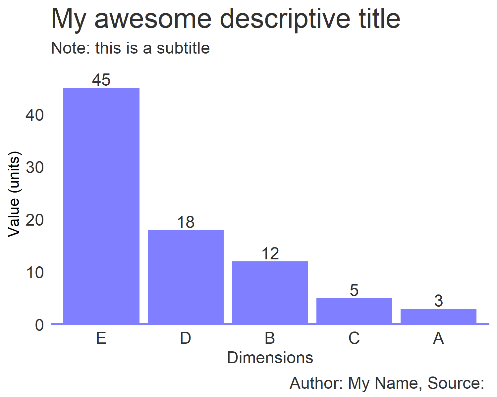
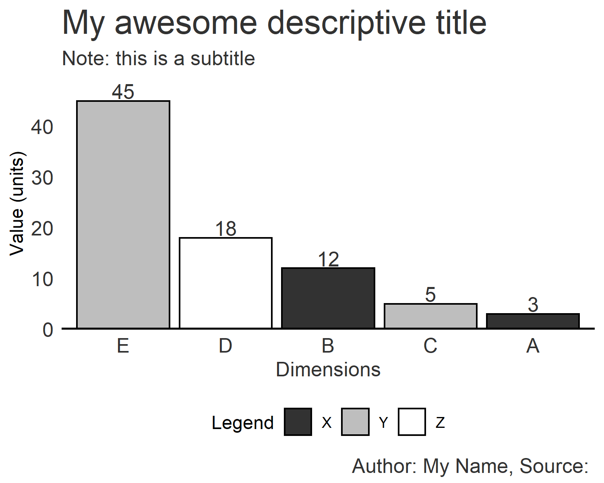
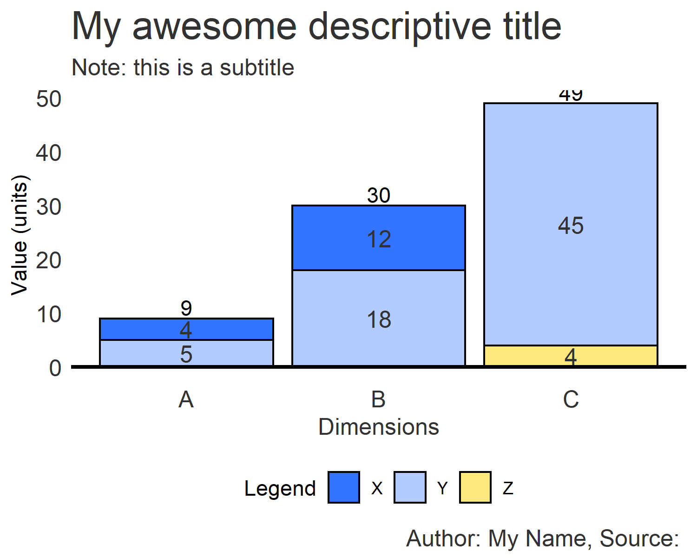
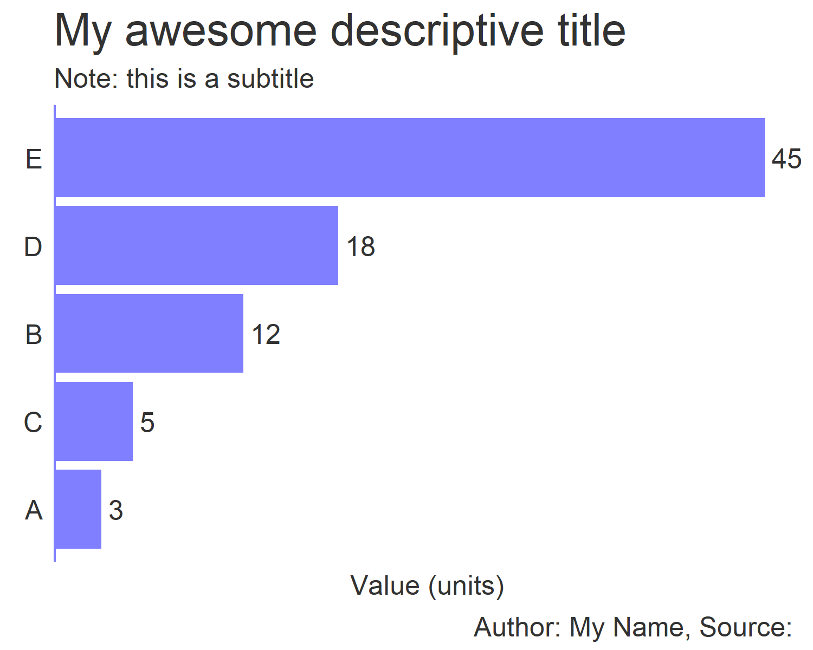
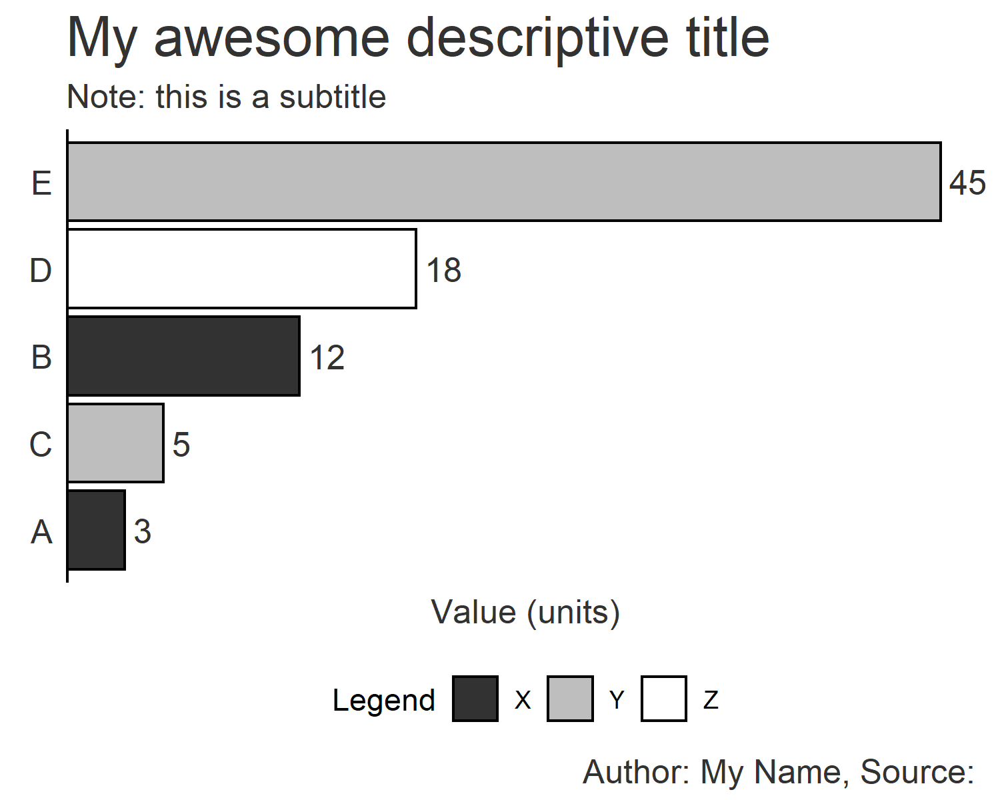
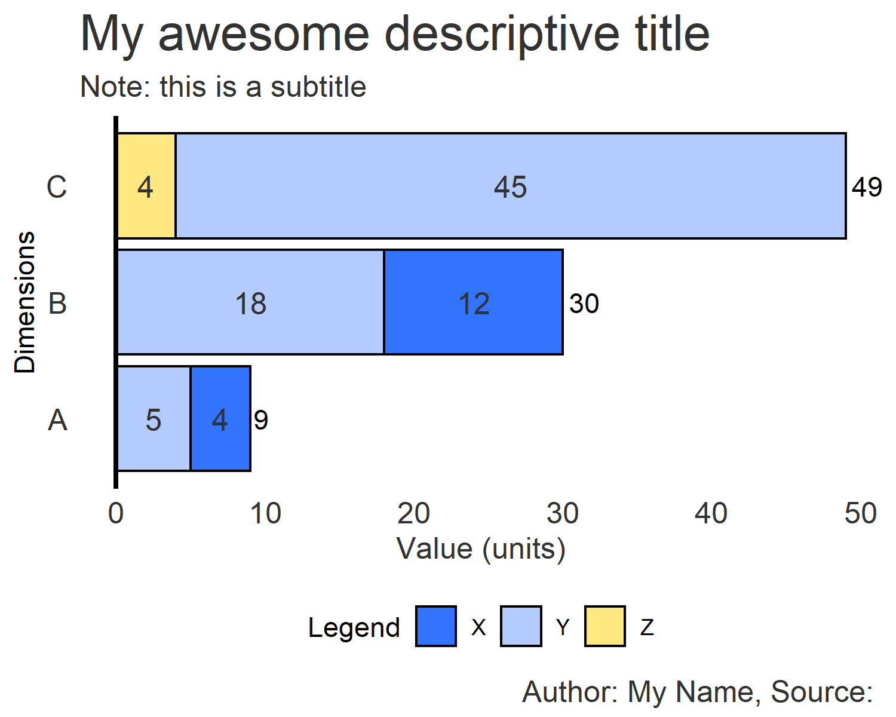
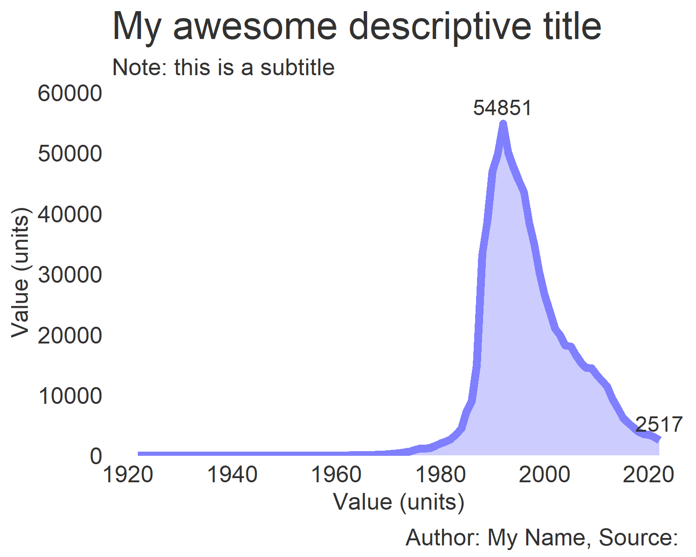
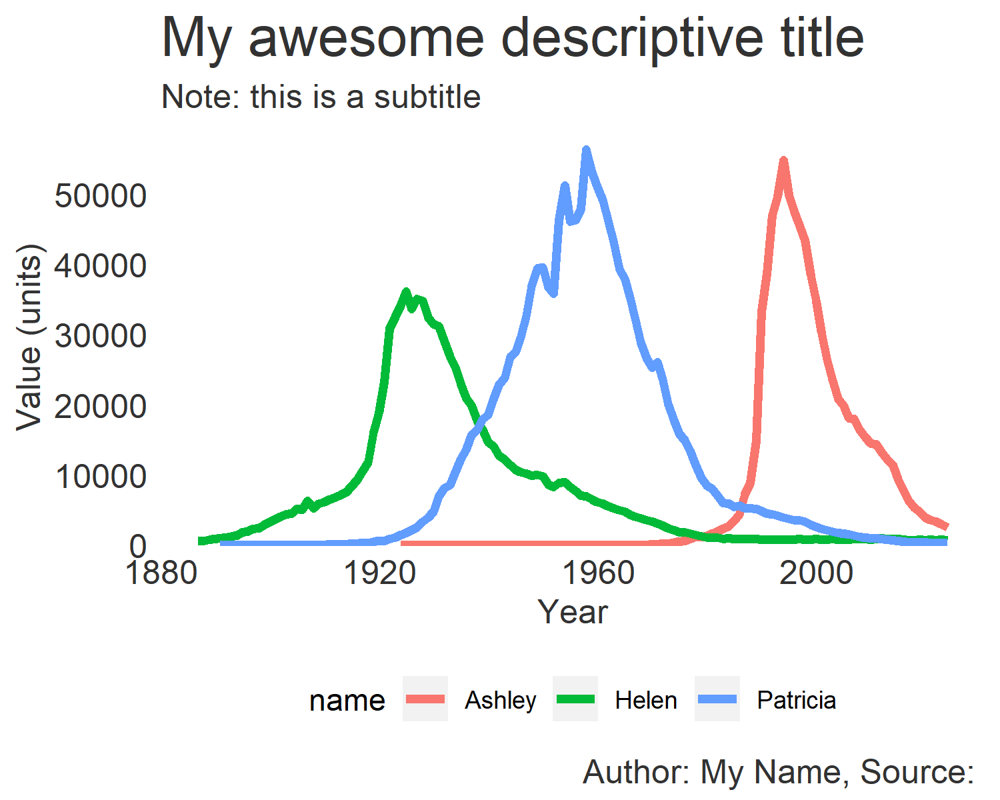
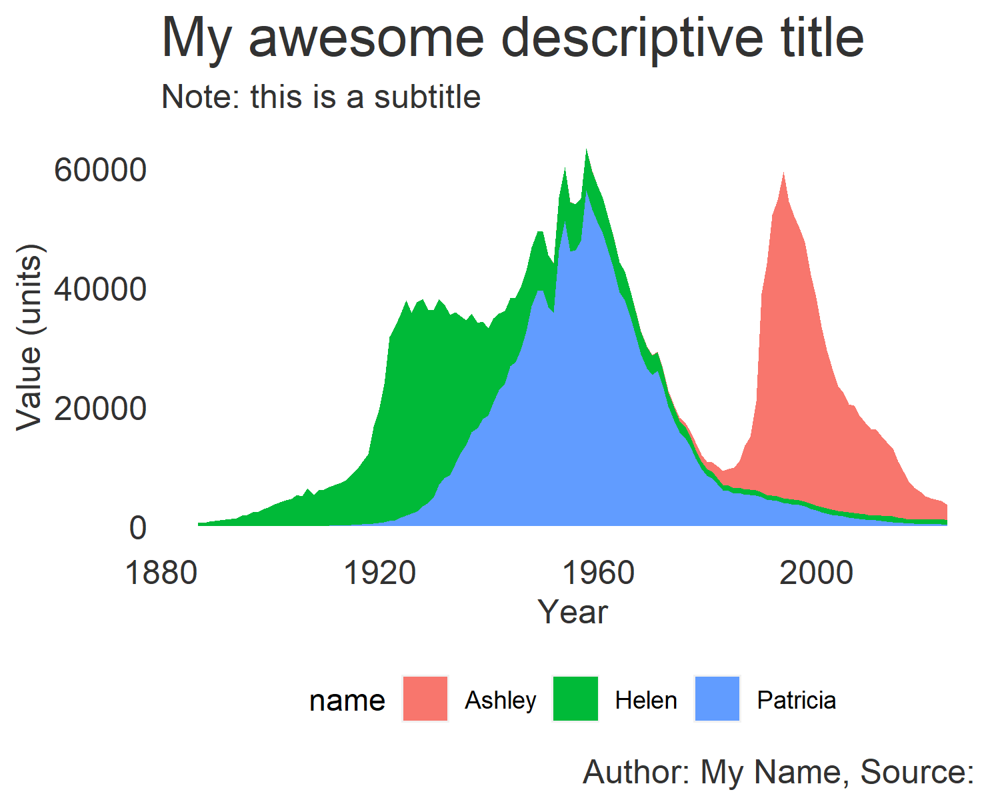
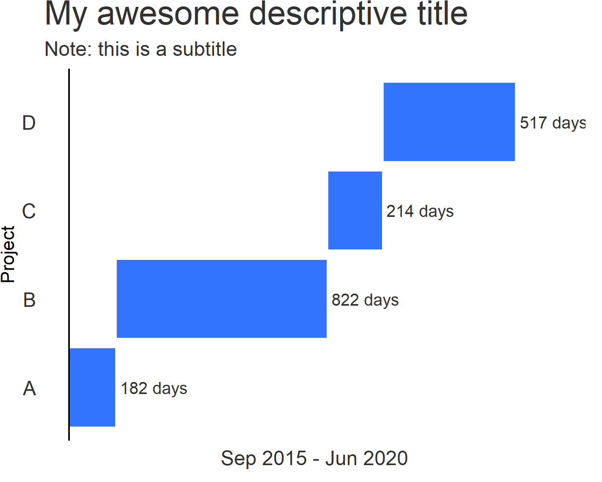

<h1 style="font-weight:normal" align="center">
  R ggplot2 Templates
</h1>

R ggplot2 templates building from https://www.r-graph-gallery.com/

[Twitter][Twitter] :speech_balloon:&nbsp;&nbsp;&nbsp;|&nbsp;&nbsp;&nbsp;[LinkedIn][LinkedIn] :necktie:&nbsp;&nbsp;&nbsp;|&nbsp;&nbsp;&nbsp;[GitHub :octocat:][GitHub]&nbsp;&nbsp;&nbsp;|&nbsp;&nbsp;&nbsp;[Website][Website] :link:

<!--
Quick Link 
-->

[Twitter]:https://twitter.com/WJSutton12
[LinkedIn]:https://www.linkedin.com/in/will-sutton-14711627/
[GitHub]:https://github.com/wjsutton
[Website]:https://wjsutton.github.io/

  
<strong>Table of Contents</strong> (click to expand)

<!-- toc -->
- [Bar Charts](https://github.com/wjsutton/ggplot2_snippets#bar-charts)
- [Line Charts](https://github.com/wjsutton/ggplot2_snippets#line-charts)
- [Gantt Charts](https://github.com/wjsutton/ggplot2_snippets#gantt-charts)
- [Voronoi Charts](https://github.com/wjsutton/ggplot2_snippets#voronoi-charts)
<!-- tocstop -->

## Bar Charts 

Vertical Bar Chart             |  Vertical Bar Chart with Legend			|  Stacked Vertical Bar Chart 	|
:-------------------------:|:-------------------------:|:-------------------------:|
[Code](bar_charts/vertical_bar_chart_plot.R)             |  [Code](bar_charts/vertical_bar_chart_plot_with_legend.R)  			|  [Code](bar_charts/vertical_stacked_bar_chart_plot_with_legend.R) 	|
  |  	|		|

Horizontal Bar Chart             |  Horizontal Bar Chart with Legend			|  Stacked Horizontal Bar Chart 	|
:-------------------------:|:-------------------------:|:-------------------------:|
[Code](bar_charts/horizontal_bar_chart_plot.R)             |  [Code](bar_charts/horizontal_bar_chart_plot_with_legend.R)  			|  [Code](bar_charts/horizontal_stacked_bar_chart_plot_with_legend.R) 	|
  |  	|		|

## Line Charts 

Single Line Chart             |  Multiple Line Chart			|  Animated Line Chart 	|
:-------------------------:|:-------------------------:|:-------------------------:|
[Code](line_charts/line_chart_single_plot.R)             |  [Code](line_charts/line_chart_multiple_plot.R)  			|  [Coming Soon] 	|
  |  	|		|

Single Area Chart             |  Stacked Area Chart			|  Animated Area Chart 	|
:-------------------------:|:-------------------------:|:-------------------------:|
[Coming Soon]            |  [Code](line_charts/stacked_area_chart_plot.R)  			|  [Coming Soon] 	|
  |  	|		|

## Gantt Charts

  

**Code**: click [here](bar_charts/simple_gantt_chart_plot.R)

## Voronoi Charts 

  

**Code**: click [here](voronoi_charts/README_FOOTBALL_VORONOI.md)
